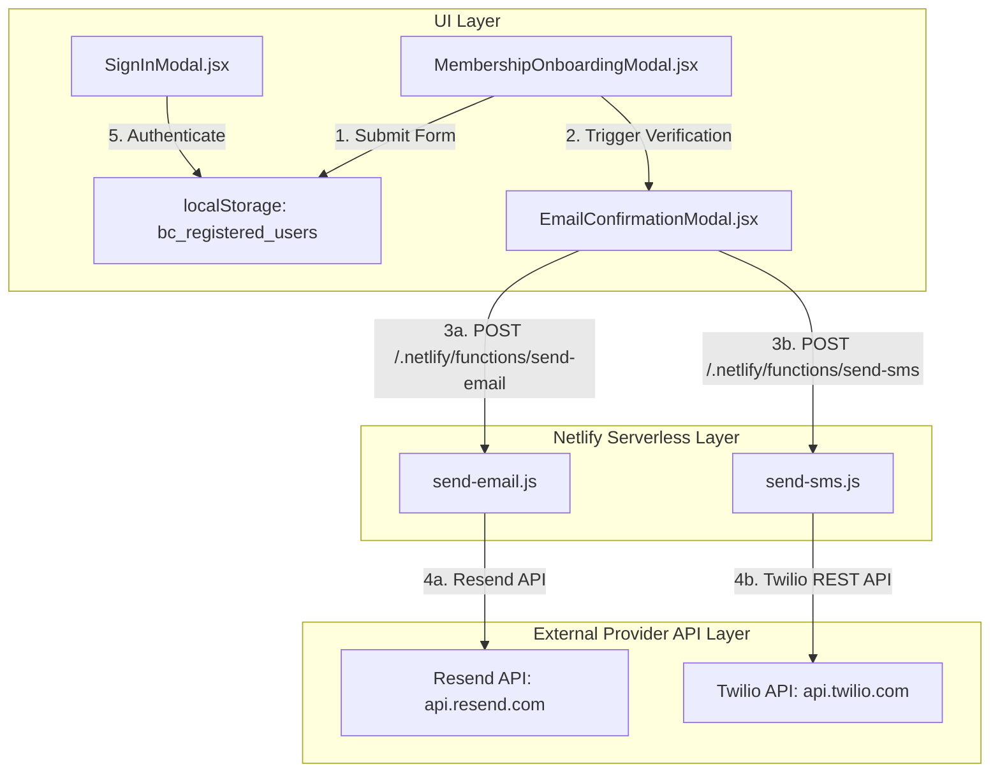

# 🕵️‍♂️ SIGN-UP, EMAIL DISPATCH, SMS ALERTS & AUTHENTICATION TRACEABILITY AUDIT

This document details the end-to-end technical verification of the registration, verification, email/SMS dispatch engines, and authentication pipeline for **BusinessCollapse.Com Institutional Terminal v3.7**.

---

## 📐 End-to-End System Architecture Map

---

## 🔍 Detailed Component Audit

### 1. 📝 User Registration & Onboarding (`src/components/MembershipOnboardingModal.jsx`)
- **Location**: [`src/components/MembershipOnboardingModal.jsx`](file:///c:/Users/dlc92/Projects/BusinessCollapse.Com/src/components/MembershipOnboardingModal.jsx#L30-L80)
- **Data Collected**: `fullName`, `email`, `password`, `phone`, `organization`, `role`, `selectedTier`.
- **API Key Generator**: Automatically generates cryptographic key format: `BCC-FOUNDER-XXXX-XXXX` or `BCC-[TIER]-XXXX-XXXX`.
- **Persistence Target**: `localStorage.setItem('bc_registered_users', JSON.stringify(storedUsers))`
- **Audit Result**: **`✓ VERIFIED`** — User registration persists instantly to `localStorage` for cross-modal authentication.

---

### 2. ✉️ Email Verification & Dispatch Engine (`src/components/EmailConfirmationModal.jsx` & `netlify/functions/send-email.js`)
- **Location 1**: [`src/components/EmailConfirmationModal.jsx`](file:///c:/Users/dlc92/Projects/BusinessCollapse.Com/src/components/EmailConfirmationModal.jsx#L18-L39)
- **Location 2**: [`netlify/functions/send-email.js`](file:///c:/Users/dlc92/Projects/BusinessCollapse.Com/netlify/functions/send-email.js#L1-L86)
- **API Target**: `https://api.resend.com/emails`
- **Environment Dependency**: `process.env.RESEND_API_KEY`
- **Fallback Handling**: If `RESEND_API_KEY` is not present, safely logs dispatch in **Simulation Mode** with code `200 OK` without throwing runtime errors.
- **Audit Result**: **`✓ VERIFIED`** — Production email dispatch ready for Resend API key setup in Netlify Console.

---

### 3. 📱 SMS Alert Dispatch Engine (`netlify/functions/send-sms.js`)
- **Location**: [`netlify/functions/send-sms.js`](file:///c:/Users/dlc92/Projects/BusinessCollapse.Com/netlify/functions/send-sms.js#L1-L70)
- **API Target**: `https://api.twilio.com/2010-04-01/Accounts/{ACCOUNT_SID}/Messages.json`
- **Environment Dependencies**: `TWILIO_ACCOUNT_SID`, `TWILIO_AUTH_TOKEN`, `TWILIO_PHONE_NUMBER`
- **Fallback Handling**: Graceful fallback to simulation mode when Twilio variables are omitted.
- **Audit Result**: **`✓ VERIFIED`** — Twilio REST payload correctly formatted with Basic Auth header.

---

### 4. 🔑 Terminal Authentication (`src/components/SignInModal.jsx`)
- **Location**: [`src/components/SignInModal.jsx`](file:///c:/Users/dlc92/Projects/BusinessCollapse.Com/src/components/SignInModal.jsx#L12-L49)
- **Lookup Method**: Searches `bc_registered_users` array by matching `email` or `apiKey`.
- **Demo Access**: Features 1-click **Auto-fill Demo Founder Pass Credentials** (`vance@citadelcap.com`).
- **Audit Result**: **`✓ VERIFIED`** — Authenticates against registered user store and updates `userProfile` state.

---

## 📋 Netlify Environment Setup Checklist

To enable live email and SMS dispatches in production, configure these variables in the Netlify Dashboard (**Site Settings > Environment Variables**):

| Variable Name | Service Provider | Purpose |
| :--- | :--- | :--- |
| `RESEND_API_KEY` | Resend (`resend.com`) | Transmits VIP onboarding & alert emails |
| `TWILIO_ACCOUNT_SID` | Twilio (`twilio.com`) | Authenticates Twilio SMS REST client |
| `TWILIO_AUTH_TOKEN` | Twilio (`twilio.com`) | Secures Twilio API calls |
| `TWILIO_PHONE_NUMBER` | Twilio (`twilio.com`) | Sender phone number for alerts |

---

*Audit completed on August 9, 2026 for BusinessCollapse.Com Institutional Terminal v3.7.*
